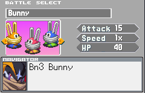

# Package Setup

Welcome to the enemies tutorial. In this tutorial we will be showing how the bunny enemy is made. Below is the layout of the mod. (image and sound resources excluded.)

```title="Project Layout"
    Bunny/
        battle_helpers.lua  # Additional helper class for bunny.
        character.lua       # Main lua for all Bunny code
        entry.lua           # Entry lua for Bunny V1/SP/NM
        ZapRing/
            entry.lua       # ZapRing code
    MegaBunny/
        entry.lua           # Entry lua for MegaBunny variation
    TuffBunny/
        entry.lua           # Entry lua for TuffBunny variation
    entry.lua               # Main entry for the mod

```

!!! note
    This project layout is not a requirement, but I have done this for the sake of keeping the lines of code in each file down.
    Most of the code is contained in the Bunny folder. The other forms simply reference bunny.

## Package entry.lua

The entry.lua in the base folder is the code that will first be run whenever the package is loaded. It is fairly simple.

### Require Scripts

```lua title="entry.lua"
--ID of the package
local package_id = "com.louise.Bunny"
-- prefix of the character id
local character_id = "com.louise.enemy."

function package_requires_scripts()
  --Define characters here.
  Engine.define_character(character_id .. "Bunny", _modpath .. "Bunny")
  Engine.define_character(character_id .. "TuffBunny", _modpath .. "TuffBunny")
  Engine.define_character(character_id .. "MegaBunny", _modpath .. "MegaBunny")
end
```

First, we define the ID of the package and a character prefix.

Like all mods, the package needs to have a unique ID as well as each of the enemies. A combination of your username and the enemy name should work here.

```lua
 Engine.define_character(id, directory)
```

In this case, we have defined the prefix "com.louise.enemy." above, and this is appended with "Bunny" through the use of the ".." operator.

The directory we will have the Bunny code is named "Bunny", which is why we have **\_modpath .. "Bunny"**. The engine will expect another entry.lua file in that directory.

!!! note
    We have defined multiple packages here as the name of the enemy changes for each version. In the current build of ONB, enemies with different names need separate packages.

### Package Init

```lua
--package init.
function package_init(package)
  package:declare_package_id(package_id)
  package:set_name("Bunny")
  package:set_description("Bn3 Bunny")
  package:set_speed(1)
  package:set_attack(15)
  package:set_health(40)
  package:set_preview_texture_path(_modpath .. "preview.png")
end

```

The code under package_init directly corresponds with what is shown on the MobSelect screen. As of now, this is only for display purposes and the values set here have no actual effect on the HP of the mob, etc.



### Package build

```lua
function package_build(mob)
  local spawner = mob:create_spawner(character_id .. "Bunny", Rank.V1)
  spawner:spawn_at(4, 1)
  local spawner = mob:create_spawner(character_id .. "Bunny", Rank.SP)
  spawner:spawn_at(5, 2)
end
```

Lastly we have package_build which sets up the battlefield for you in mobselect.
The possible ranks available are V1-V3, Rare1/2, SP, and NM, but it is up to the mod maker to provide support for the versions.

Note: If we wanted to spawn V2, V3 versions, since they have separate packages, you would substitute
TuffBunny, Rank.V1 or MegaBunny, Rank.V1.


